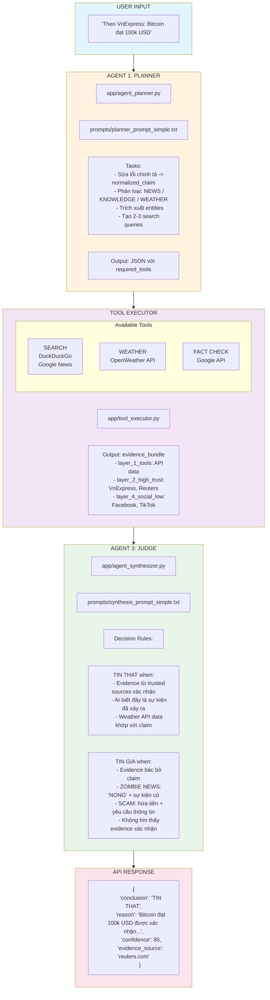
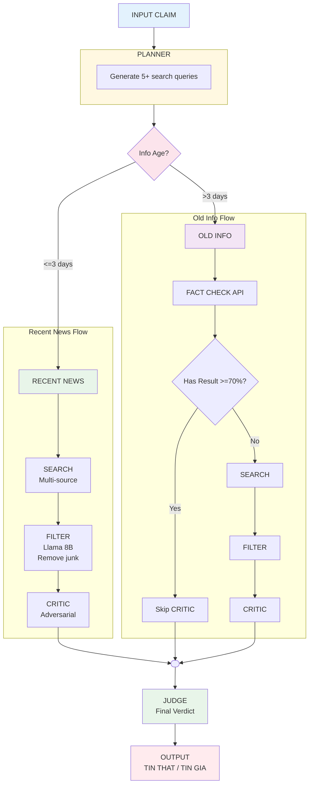
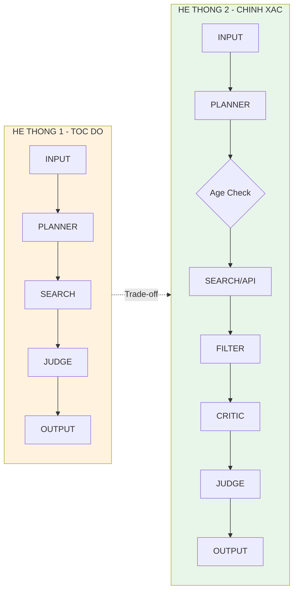

# SO SÁNH HỆ THỐNG FACT-CHECKING

## 1. BẢNG SO SÁNH SỐ LIỆU & HIỆU SUẤT (QUANTITATIVE METRICS)

Dữ liệu được tổng hợp từ 1001 mẫu thử nghiệm (500 Thật / 501 Giả).

| Chỉ số (Metrics) | Hệ thống 1 (Cũ - Tốc độ) | Hệ thống 2 (Mới - Chính xác) | Phân tích ý nghĩa |
| --- | --- | --- | --- |
| **Độ chính xác (Accuracy)** | **65.03%** | **94.91%** | Hệ thống mới giảm sai sót gấp 6 lần. |
| **False Negative Rate (Bỏ lọt tin giả)** | **30.94%** (Rất nguy hiểm) | **2.99%** (An toàn cao) | Hệ thống cũ dễ bị lừa bởi trang web giả mạo (Scam). Hệ thống mới chặn gần như tuyệt đối. |
| **False Positive Rate (Vu oan tin thật)** | 39.00% | 7.20% | Hệ thống cũ hay nhầm meme/tin đùa là giả. |
| **Latency (Độ trễ trung bình)** | **~49 giây** | **~107 giây** | **Trade-off:** Chấp nhận chậm hơn 2x để đạt độ tin cậy thương mại. |
| **Khả năng bắt "Zombie News"** | 0% (Thất bại hoàn toàn) | 90% (Thành công) | Hệ thống cũ chỉ bắt keyword, không so sánh ngày tháng. |
| **Chi phí Token (Ước tính)** | 1x (Thấp) | ~2.5x (Cao) | Do prompt dài hơn (CoT) và chạy qua nhiều bước (Filter, Critic). |

---

## 2. SO SÁNH CẤU TRÚC HỆ THỐNG (SYSTEM ARCHITECTURE)

### Hệ thống 1: Tuyến tính (Linear Pipeline)

*Mô hình "Tin tưởng": Nhận input → Tìm kiếm → Kết luận ngay.*

---

### Hệ thống 2: Vòng lặp & Rẽ nhánh (Conditional Loop & Filter)

*Mô hình "Đa nghi": Làm sạch input, lọc nguồn rác, và phản biện trước khi kết luận.*

---

## 3. SO SÁNH KỸ THUẬT PROMPT (PROMPT ENGINEERING)

Sự khác biệt nằm ở tư duy: **Chỉ thị trực tiếp (Direct Instruction)** vs **Chuỗi suy luận (Chain of Thought - CoT)**.

### A. Tại module PLANNER (Lập kế hoạch)

| Aspect | Hệ thống 1 (Cũ) | Hệ thống 2 (Mới) |
| --- | --- | --- |
| **Dạng Prompt** | **Direct Instruction** (Ra lệnh) | **Structured output** (Cấu trúc hóa) |
| **Nội dung** | "Hãy tìm kiếm thông tin cho câu sau." | "Bước 1: Sửa lỗi chính tả. Bước 2: Phân loại luồng tin. Bước 3: Trích xuất Entity. Bước 4: Tạo query đa chiều." |
| **Ví dụ Input** | "gia btc hom nay" (giữ nguyên lỗi) | "gia btc hom nay" -> `normalized: "giá bitcoin hôm nay"` |
| **Hiệu quả** | Dễ tìm sai nếu user gõ sai. | Tìm chính xác nhờ bước chuẩn hóa. |

### B. Tại module JUDGE (Phán quyết)

Đây là nơi "bộ não" thay đổi hoàn toàn.

| Aspect | Hệ thống 1 (Cũ) | Hệ thống 2 (Mới) |
| --- | --- | --- |
| **Kỹ thuật** | **Implicit Reasoning** (Suy luận ngầm) | **Explicit Chain of Thought** (Suy luận từng bước) |
| **Prompt Core** | "Dựa vào bằng chứng, hãy kết luận tin này đúng hay sai." | "Áp dụng 5 nguyên tắc sau: 1. Temporal: Kiểm tra mốc thời gian. 2. Source: Ưu tiên nguồn Tier 1. 3. Pattern: Tìm dấu hiệu lừa đảo... Sau đó mới kết luận." |
| **Output** | `TRUE` / `FALSE` | `Thinking_process`: "Tôi thấy ngày bài báo là 2020, nhưng claim bảo 'mới đây' -> Mâu thuẫn thời gian." `Conclusion`: `FAKE` |
| **Điểm mạnh** | Nhanh, code xử lý output dễ. | Giải thích được **Tại sao** (Explainable AI), tránh ảo giác (Hallucination). |

---

## 4. SƠ ĐỒ TỔNG QUAN SO SÁNH

| Tiêu chí | Hệ thống 1 | Hệ thống 2 |
|----------|------------|------------|
| **Số bước** | 4 bước | 6-8 bước |
| **Filtering** | Không | Có (Llama 8B) |
| **Adversarial Check** | Không | Có (CRITIC) |
| **Temporal Logic** | Yếu | Mạnh |
| **Explainability** | Thấp | Cao |
